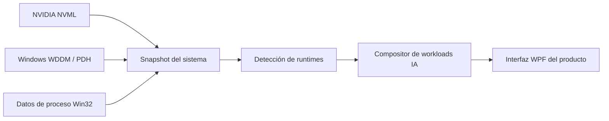

<p align="center">
  <a href="./README.md">English</a>
  ·
  <a href="./README.es.md"><strong>Español</strong></a>
</p>

<div align="center">

# Local AI Task Manager

### El Administrador de tareas para IA local en Windows

<p>
  Descubre qué modelos de IA local están usando tu GPU, a qué runtime pertenecen y cuánta memoria GPU local reporta Windows para su proceso principal.
</p>

<p>
  <a href="https://github.com/AlejandroDeBlas/local-ai-task-manager/releases/tag/v0.1.0"></a>
  <a href="https://github.com/AlejandroDeBlas/local-ai-task-manager/actions/workflows/ci.yml"></a>
  
  
  
  <a href="./LICENSE"></a>
  
</p>

<br>

<p align="center">
  
</p>

<p align="center">
  <a href="https://github.com/AlejandroDeBlas/local-ai-task-manager/releases/tag/v0.1.0"><strong>Descargar v0.1.0 (win-x64)</strong></a>
  &nbsp;·&nbsp;
  <a href="#inicio-rápido">Inicio rápido</a>
  &nbsp;·&nbsp;
  <a href="#características">Características</a>
  &nbsp;·&nbsp;
  <a href="#cómo-funciona">Cómo funciona</a>
  &nbsp;·&nbsp;
  <a href="#compilar-desde-el-código-fuente">Compilar desde el código fuente</a>
</p>

</div>

---

Local AI Task Manager convierte procesos GPU de Windows en workloads de IA fáciles de entender.

En lugar de preguntarte *“¿por qué llama-server.exe usa 5 GB?”*, ves el modelo, el runtime, su configuración y los procesos subyacentes en un mismo lugar.

---

## Características

<table>
<tr>
<td width="33%" valign="top">
<strong>Workloads de IA</strong><br>
Agrupa procesos controladores y runners en workloads lógicos y coherentes.
</td>
<td width="33%" valign="top">
<strong>Telemetría GPU</strong><br>
Métricas directas del dispositivo con NVML (VRAM, uso, temperatura, potencia) sin <code>nvidia-smi</code>.
</td>
<td width="33%" valign="top">
<strong>Inspector profundo</strong><br>
Inspecciona metadatos del modelo, cuantización, tamaño de contexto y líneas de comandos por proceso.
</td>
</tr>
<tr>
<td width="33%" valign="top">
<strong>Memoria GPU Windows WDDM</strong><br>
Lee los contadores <code>GPU Process Memory</code> expuestos por Windows WDDM, usando <code>Local Usage</code> para VRAM principal.
</td>
<td width="33%" valign="top">
<strong>Cero configuración</strong><br>
Identifica automáticamente instancias activas de Ollama y llama.cpp standalone sin servicios en segundo plano.
</td>
<td width="33%" valign="top">
<strong>Privacidad por diseño</strong><br>
Sin comunicación de red externa, sin analíticas, sin backend en la nube y ejecución como usuario estándar.
</td>
</tr>
</table>

---

## ¿Por qué?

El Administrador de tareas de Windows puede indicarte que un proceso está consumiendo memoria GPU, pero no que se trata de Qwen ejecutándose a través de Ollama con una cuantización y configuración de contexto específicas.

Local AI Task Manager añade esa capa de comprensión de IA que faltaba.

---

## Runtimes soportados

| Runtime | Detección runtime | Detección modelo | Estado |
|:---|:---:|:---:|:---|
| **Ollama** | ✅ | ✅ | Soportado |
| **llama.cpp / llama-server** | ✅ | ✅ | Soportado |
| **LM Studio** | 🧪 Experimental | ❌ | Solo runtime |

> **UNKNOWN > WRONG**
>
> Si Local AI Task Manager no puede demostrar qué runtime o modelo corresponde a un proceso con evidencia verificable, lo deja como desconocido en lugar de inventarlo.

---

## Inicio rápido

1. Descarga el archivo ZIP para Windows x64 desde [GitHub Releases](https://github.com/AlejandroDeBlas/local-ai-task-manager/releases/tag/v0.1.0).
2. Extrae el archivo en cualquier carpeta de tu equipo.
3. Ejecuta `LocalAITaskManager.exe`.

* Sin instalador.
* Sin cuenta ni registro.
* Sin permisos de administrador.
* No requiere instalar .NET (ejecutable autocontenido).
* Requiere una tarjeta gráfica NVIDIA con controladores estándar instalados.

> [!TIP]
> **Aviso de Windows SmartScreen:** Como el ejecutable no cuenta con certificado de firma digital comercial, Windows SmartScreen puede mostrar una advertencia informativa al tratarse de un binario recién publicado. Puedes comprobar el hash SHA256 publicado abajo, auditar el código fuente o compilar directamente desde el repositorio.

---

## Semántica de memoria GPU

La tarjeta de un workload no pretende mostrar una cifra exacta de propiedad física de VRAM para todo el workload.

El valor de VRAM corresponde a `Local Usage` reportado por Windows WDDM para el proceso principal del workload.

Los valores de los procesos miembro no se suman porque la contabilidad de memoria WDDM por proceso no está garantizada como aditiva.

| Métrica | Origen |
|:---|:---|
| **Nombre de GPU y controlador** | NVML (`nvmlDeviceGetName`) |
| **VRAM total y usada** | NVML (`nvmlDeviceGetMemoryInfo`) |
| **Uso de GPU** | NVML (`nvmlDeviceGetUtilizationRates`) |
| **Temperatura y potencia** | NVML (`nvmlDeviceGetTemperature`, `nvmlDeviceGetPowerUsage`) |
| **VRAM del proceso principal** | Windows WDDM (`\GPU Process Memory(*)\Local Usage`) |
| **Memoria no local y comprometida** | Windows WDDM (`Non Local Usage`, `Total Committed`) |
| **RAM del proceso (Working Set)** | API de memoria de procesos Win32 |

---

## Cómo funciona



<details>
<summary><strong>Detalles de arquitectura técnica</strong></summary>

Local AI Task Manager funciona mediante tres capas arquitectónicas claramente separadas:

* **`LocalAITaskManager.Core`:** Entidades de dominio puras (`SystemSnapshot`, `AiWorkloadSnapshot`, `AppSnapshot`), modelos inmutables y lógica determinista de composición. Cero dependencias con APIs específicas de Windows.
* **`LocalAITaskManager.Windows`:** Interactúa con subsistemas de Windows mediante P/Invoke:
  - NVIDIA Management Library (`nvml.dll`) resuelta exclusivamente desde rutas del sistema confiables (`System32`, `Program Files\NVIDIA Corporation\NVSMI`).
  - Performance Data Helper (`pdh.dll`) consultando los contadores `\GPU Process Memory(*)` para métricas WDDM.
  - Inspección de árboles de procesos mediante `CreateToolhelp32Snapshot`.
  - Introspección de Ollama mediante API REST en loopback local (`http://127.0.0.1:11434/api/ps`) con invalidación inmediata de caché ante cambios en los PIDs de los runners.
  - Tokenización nativa de líneas de comandos mediante `CommandLineToArgvW`.
* **`LocalAITaskManager.App`:** Interfaz gráfica oscura en WPF acelerada por hardware, con conciliación de colecciones in-place que se actualiza fluidamente a ~1 Hz sin parpadeos ni pérdida de selección.
</details>

---

## Privacidad y seguridad

| Propiedad | Estado |
|:---|:---|
| **Telemetría externa** | Ninguna |
| **Analíticas o rastreo** | Ninguna |
| **Cuenta de usuario** | No requerida |
| **Servidores en la nube** | Ninguno |
| **Comunicaciones de red** | Solo `127.0.0.1` (API local de Ollama) |
| **Permisos de administrador** | No requeridos (`asInvoker`) |
| **Persistencia en disco** | Ninguna (líneas de comandos y rutas analizadas solo en memoria) |

> [!NOTE]
> Sin comunicación de red externa. La aplicación nunca envía datos a la nube. La única petición HTTP que realiza es una consulta en bucle invertido (`loopback`) al daemon local de Ollama en `http://127.0.0.1:11434/api/ps`.

---

## Limitaciones conocidas

* **Solo Windows x64:** Requiere Windows 10 o Windows 11 (64 bits).
* **Solo tarjetas NVIDIA:** Requiere controladores NVML y WDDM de NVIDIA. Las GPUs AMD e Intel no están soportadas en la versión v0.1.0.
* **Mapeo proceso a GPU en sistemas multi-GPU:** Se muestran las métricas globales de cada GPU, pero la asociación proceso a adaptador mediante DXGI LUID está planificada para próximas versiones.
* **Detección de modelos en LM Studio:** La detección del proceso en ejecución es experimental; la introspección de modelos permanece desactivada hasta disponer de soporte oficial sin daemons.
* **Métricas de inferencia:** La velocidad de generación (tokens/segundo, TTFT) y el desglose de KV cache aún no están implementados.

---

## Verificación SHA256

Comprueba la integridad del archivo descargado:

```powershell
Get-FileHash .\LocalAITaskManager-v0.1.0-win-x64.zip -Algorithm SHA256
```

Checksum SHA256 esperado:
```text
298638566f5bfd59ceb10b07d8fc5c613a3304dd8b20c8e1fdead66c3de382d4
```

También puedes comparar el hash con el archivo oficial [`LocalAITaskManager-v0.1.0-win-x64.zip.sha256`](https://github.com/AlejandroDeBlas/local-ai-task-manager/releases/download/v0.1.0/LocalAITaskManager-v0.1.0-win-x64.zip.sha256) publicado en la release.

---

## Compilar desde el código fuente

<details>
<summary><strong>Instrucciones de compilación</strong></summary>

### Requisitos previos
* Windows 10 / 11 (x64)
* [.NET 10.0 SDK](https://dotnet.microsoft.com/download) o superior
* Git

### Compilar y ejecutar pruebas
```powershell
git clone https://github.com/AlejandroDeBlas/local-ai-task-manager.git
cd local-ai-task-manager

dotnet restore
dotnet build LocalAITaskManager.sln -c Release --no-restore
dotnet test LocalAITaskManager.sln -c Release --no-build
dotnet format LocalAITaskManager.sln --verify-no-changes
```

### Empaquetar el ZIP de distribución
```powershell
.\scripts\release.ps1 -Version 0.1.0
```
Los artefactos generados se sitúan en `artifacts/release/v0.1.0/`.
</details>

---

## Contribuir

¡Las contribuciones son bienvenidas! Consulta [CONTRIBUTING.md](CONTRIBUTING.md) para conocer las pautas sobre estilo de código, pruebas y nuestra política de verificación **UNKNOWN > WRONG**.

---

## Roadmap

Posibles próximos pasos para futuras versiones:
- Métricas de rendimiento de inferencia (tokens/s en decodificación y prefill, TTFT)
- Desglose de asignación de VRAM (pesos del modelo, KV cache, sobrecarga del runtime)
- Mapeo de procesos a adaptadores en configuraciones multi-GPU mediante DXGI LUID
- Soporte para runtimes adicionales (ComfyUI, vLLM)
- Exploración de compatibilidad con AMD Radeon (DirectML / WDDM)
- Opción de minimizar a la bandeja del sistema

---

## Licencia

Distribuido bajo la [Licencia MIT](LICENSE).
