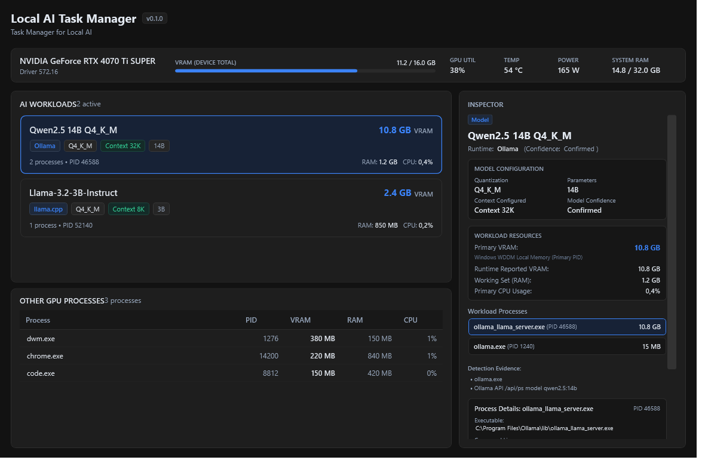
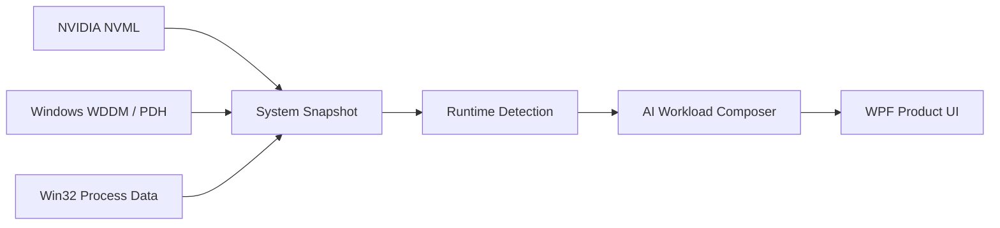

<p align="center">
  <a href="./README.md"><strong>English</strong></a>
  ·
  <a href="./README.es.md">Español</a>
</p>

<div align="center">

# Local AI Task Manager

### Task Manager for Local AI on Windows

<p>
  See which local AI models are using your GPU, which runtime they belong to, and how much GPU-local memory Windows reports for their primary process.
</p>

<p>
  <a href="https://github.com/AlejandroDeBlas/local-ai-task-manager/releases/tag/v0.1.0"></a>
  <a href="https://github.com/AlejandroDeBlas/local-ai-task-manager/actions/workflows/ci.yml"></a>
  
  
  
  <a href="./LICENSE"></a>
  
</p>

<br>

<p align="center">
  
</p>

<p align="center">
  <a href="https://github.com/AlejandroDeBlas/local-ai-task-manager/releases/tag/v0.1.0"><strong>Download v0.1.0 (win-x64)</strong></a>
  &nbsp;·&nbsp;
  <a href="#quick-start">Quick start</a>
  &nbsp;·&nbsp;
  <a href="#features">Features</a>
  &nbsp;·&nbsp;
  <a href="#how-it-works">How it works</a>
  &nbsp;·&nbsp;
  <a href="#build-from-source">Build from source</a>
</p>

</div>

---

Local AI Task Manager turns raw Windows GPU processes into human-readable AI workloads.

Instead of asking *"why is llama-server.exe using 5 GB?"*, you see the model, runtime, configuration, and underlying process tree in one place.

---

## Features

<table>
<tr>
<td width="33%" valign="top">
<strong>AI Workloads</strong><br>
Groups runtime controllers and model runners into cohesive, logical workloads.
</td>
<td width="33%" valign="top">
<strong>GPU Telemetry</strong><br>
Direct NVML device metrics (VRAM, utilization, temperature, power) without <code>nvidia-smi</code>.
</td>
<td width="33%" valign="top">
<strong>Deep Inspector</strong><br>
Inspect model metadata, quantization, context size, and individual process command lines.
</td>
</tr>
<tr>
<td width="33%" valign="top">
<strong>Windows WDDM GPU Memory</strong><br>
Reads <code>GPU Process Memory</code> counters exposed by Windows WDDM, using <code>Local Usage</code> for primary VRAM.
</td>
<td width="33%" valign="top">
<strong>Zero Configuration</strong><br>
Automatically identifies active Ollama and standalone llama.cpp instances without background services.
</td>
<td width="33%" valign="top">
<strong>Private by Design</strong><br>
No external network communication, no analytics, no cloud backend, and runs as standard user.
</td>
</tr>
</table>

---

## Why?

Windows Task Manager can tell you that a process is consuming GPU memory, but not that it is Qwen running through Ollama with a specific quantization and context configuration.

Local AI Task Manager adds that missing AI-aware layer.

---

## Supported runtimes

| Runtime | Runtime detection | Model detection | Status |
|:---|:---:|:---:|:---|
| **Ollama** | ✅ | ✅ | Supported |
| **llama.cpp / llama-server** | ✅ | ✅ | Supported |
| **LM Studio** | 🧪 Experimental | ❌ | Runtime only |

> **UNKNOWN > WRONG**
>
> If Local AI Task Manager cannot prove which runtime or model owns a process with verifiable evidence, it leaves it unknown instead of guessing.

---

## Quick start

1. Download the latest Windows x64 ZIP from [GitHub Releases](https://github.com/AlejandroDeBlas/local-ai-task-manager/releases/tag/v0.1.0).
2. Extract the archive anywhere on your machine.
3. Run `LocalAITaskManager.exe`.

* No installer.
* No account.
* No administrator privileges required.
* No .NET installation required (self-contained binary).
* Requires an NVIDIA GPU with standard drivers installed.

> [!TIP]
> **Windows SmartScreen:** The executable is currently unsigned, so Windows SmartScreen may show a warning for a newly downloaded binary. You can verify the published SHA256 checksum below, inspect the source code, or build locally from source.

---

## GPU memory semantics

The workload card does not claim to show an exact physical ownership total for an entire workload.

Its VRAM value is the Windows WDDM `Local Usage` reported for the workload's primary process.

Member-process values are intentionally not summed because WDDM process memory accounting is not guaranteed to be additive.

| Metric | Source |
|:---|:---|
| **GPU Name & Driver** | NVML (`nvmlDeviceGetName`) |
| **Total / Used VRAM** | NVML (`nvmlDeviceGetMemoryInfo`) |
| **GPU Utilization** | NVML (`nvmlDeviceGetUtilizationRates`) |
| **Temperature & Power** | NVML (`nvmlDeviceGetTemperature`, `nvmlDeviceGetPowerUsage`) |
| **Primary Process VRAM** | Windows WDDM (`\GPU Process Memory(*)\Local Usage`) |
| **Process Non-Local & Committed** | Windows WDDM (`Non Local Usage`, `Total Committed`) |
| **Process RAM (Working Set)** | Win32 Process Memory API |

---

## How it works



<details>
<summary><strong>Technical architecture details</strong></summary>

Local AI Task Manager operates across three cleanly separated architectural layers:

* **`LocalAITaskManager.Core`:** Pure domain entities (`SystemSnapshot`, `AiWorkloadSnapshot`, `AppSnapshot`), immutable models, and deterministic composition logic. Zero Windows dependencies.
* **`LocalAITaskManager.Windows`:** Interacts with Windows subsystems via P/Invoke:
  - NVIDIA Management Library (`nvml.dll`) resolved exclusively from trusted system paths (`System32`, `Program Files\NVIDIA Corporation\NVSMI`).
  - Performance Data Helper (`pdh.dll`) querying `\GPU Process Memory(*)` counters for WDDM allocations.
  - Process hierarchy inspection via `CreateToolhelp32Snapshot`.
  - Ollama introspection via local loopback API (`http://127.0.0.1:11434/api/ps`) with cache invalidated instantly upon runner PID changes.
  - Native command-line tokenization via `CommandLineToArgvW`.
* **`LocalAITaskManager.App`:** Hardware-accelerated WPF dark UI featuring keyed in-place collection reconciliation that updates smoothly at ~1 Hz without flickering or losing selection state.
</details>

---

## Privacy & security

| Property | Status |
|:---|:---|
| **External Telemetry** | None |
| **Analytics / Tracking** | None |
| **User Account** | None required |
| **Cloud Backend** | None |
| **Network Communication** | `127.0.0.1` only (local Ollama API) |
| **Administrator Privileges** | Not required (`asInvoker`) |
| **Disk Persistence** | None (command lines & paths inspected in-memory only) |

> [!NOTE]
> No external network communication. The application never sends data to the cloud. The only HTTP request made is a loopback query to the local Ollama daemon on `http://127.0.0.1:11434/api/ps`.

---

## Known limitations

* **Windows x64 only:** Requires Windows 10 or Windows 11 (64-bit).
* **NVIDIA only:** Relies on NVML and NVIDIA WDDM drivers. AMD and Intel GPUs are not supported in v0.1.0.
* **Multi-GPU process mapping:** Global multi-GPU metrics are displayed, but per-process adapter assignment via DXGI LUID is planned for future versions.
* **LM Studio model detection:** Runtime process detection is experimental; model introspection is disabled pending official support.
* **Inference metrics:** Tokens/second, time-to-first-token (TTFT), and KV-cache breakdowns are not yet supported.

---

## Checksum verification

Verify the integrity of your downloaded release archive:

```powershell
Get-FileHash .\LocalAITaskManager-v0.1.0-win-x64.zip -Algorithm SHA256
```

Expected SHA256:
```text
298638566f5bfd59ceb10b07d8fc5c613a3304dd8b20c8e1fdead66c3de382d4
```

You can also verify against the published [`LocalAITaskManager-v0.1.0-win-x64.zip.sha256`](https://github.com/AlejandroDeBlas/local-ai-task-manager/releases/download/v0.1.0/LocalAITaskManager-v0.1.0-win-x64.zip.sha256) asset on the release page.

---

## Build from source

<details>
<summary><strong>Build instructions</strong></summary>

### Prerequisites
* Windows 10 / 11 (x64)
* [.NET 10.0 SDK](https://dotnet.microsoft.com/download) or later
* Git

### Compile & Test
```powershell
git clone https://github.com/AlejandroDeBlas/local-ai-task-manager.git
cd local-ai-task-manager

dotnet restore
dotnet build LocalAITaskManager.sln -c Release --no-restore
dotnet test LocalAITaskManager.sln -c Release --no-build
dotnet format LocalAITaskManager.sln --verify-no-changes
```

### Package Release ZIP
```powershell
.\scripts\release.ps1 -Version 0.1.0
```
Artifacts are staged in `artifacts/release/v0.1.0/`.
</details>

---

## Contributing

Contributions are welcome! Please read [CONTRIBUTING.md](CONTRIBUTING.md) for guidelines on development, testing, and our **UNKNOWN > WRONG** verification policy.

---

## Roadmap

Potential next steps for future releases:
- Inference performance counters (decode tokens/s, prefill tokens/s, TTFT)
- VRAM allocation breakdown (model weights, KV cache, runtime overhead)
- Multi-GPU process-to-adapter mapping via DXGI LUID
- Additional runtimes (ComfyUI, vLLM)
- AMD Radeon exploration (DirectML / WDDM)
- Optional system tray minimization

---

## License

Distributed under the [MIT License](LICENSE).
